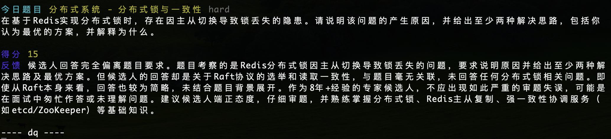
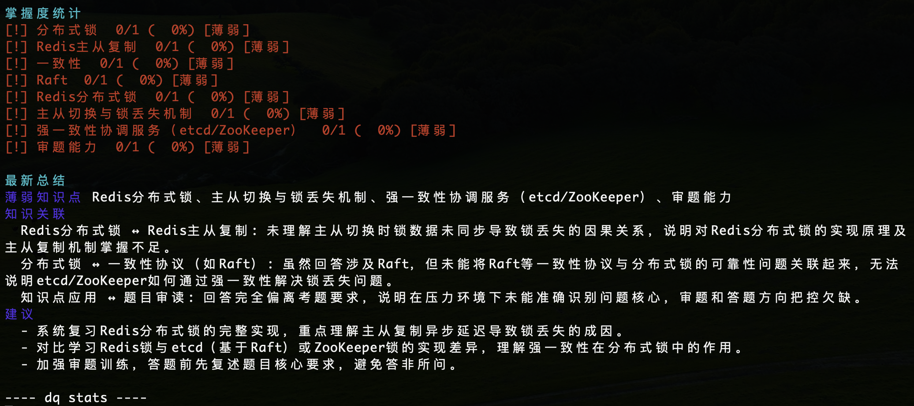
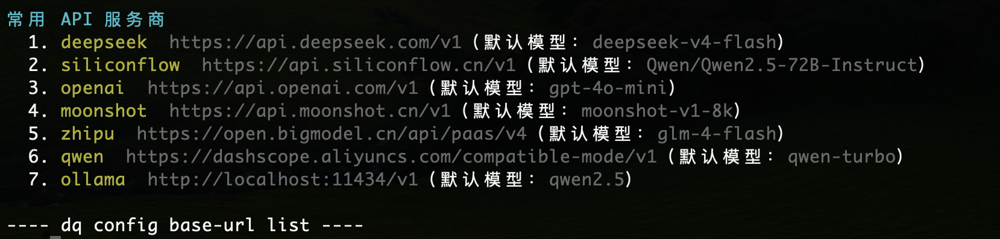
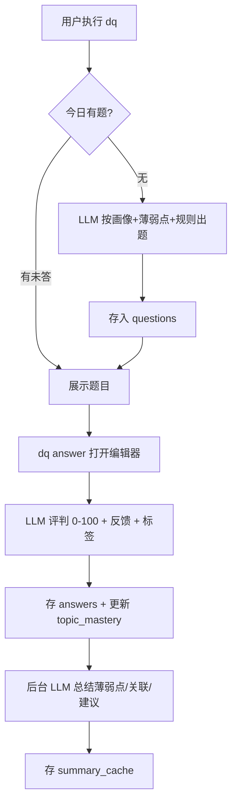

# daily-q

> 每日一题 · 面向后端/数据方向程序员的面试知识练习 CLI


每天出一道针对你薄弱点的面试题 → 在编辑器里作答 → AI 评分反馈 → 后台分析薄弱点 → 明天的题自动偏向薄弱点。



## 功能特性

- 🎯 **个性化出题**：基于面试画像（年限/岗位/技术栈/级别/方向）+ 薄弱知识点 + 自定义规则，由 LLM 动态生成，不依赖本地题库
- ✍️ **编辑器作答**：复用 `$EDITOR`（默认 vim）写长答案，文件头自带题目提示
- 📊 **AI 评判**：0-100 分 + 详细反馈 + 知识点标签，回答后可立即看到参考答案
- 🧠 **掌握度画像**：按知识点统计正确率与等级（强 `+` / 中 `~` / 弱 `!`）
- 🔄 **后台总结**：答题后自动生成薄弱点、知识关联与学习建议
- 🀄 **全中文体验**：题目、提示、评分、总结全部使用中文，专注面试练习
- 📦 **零运维**：SQLite 单文件存储，数据全部在 `~/.daily-q/`



## 安装

### 从 GitHub Releases 下载（推荐）

到 [Releases](https://github.com/Angryshark128/daily-q/releases) 下载对应平台的压缩包并解压：

| 平台 | 压缩包 |
|------|--------|
| macOS Intel / Apple Silicon | `daily-q-<target>.tar.gz` |
| Windows 64 位 / 32 位 | `daily-q-<target>.zip` |

解压后把 `dq`（Windows 为 `dq.exe`）加入 PATH。压缩包内附 `checksums.txt` 可校验完整性。

### 从源码编译

需要 Rust 工具链（≥1.88）。

```bash
git clone https://github.com/Angryshark128/daily-q && cd daily-q
cargo build --release
# 产物：target/release/dq（建议加入 PATH）
```

## 快速开始

```bash
# 1. 一键配置 AI（选择服务商 → 输入 Key，自动设置 base_url 与模型，测试通过后保存）
dq config ai

# 2. 设置面试画像（影响出题的针对性）
dq profile setup

# 3. 出题 & 答题
dq            # 生成 / 查看今日题目
dq answer     # 打开编辑器作答，AI 评分反馈
dq stats      # 查看掌握度与学习建议

# 4. 查看掌握度与学习建议
dq stats
```

## 命令参考

| 命令 | 说明 |
|------|------|
| `dq [--difficulty <easy\|medium\|hard>]` | 生成/显示今日题目，可指定难度 |
| `dq answer` | 打开编辑器作答 |
| `dq skip` | 跳过今日题目 |
| `dq stats` | 掌握度统计 + 最新总结 |
| `dq rule add <文本>` | 添加出题规则（如"只出场景题"） |
| `dq rule list` | 列出所有规则 |
| `dq rule remove <id>` | 删除规则 |
| `dq profile` | 查看当前画像 |
| `dq profile setup` | 交互式设置画像 |
| `dq config` | 查看当前配置 |
| `dq config ai` | **一键配置 AI**：选服务商 → 输 Key → 自动设置地址与模型 → 测试通过后保存 |
| `dq config model` | 交互式选择当前服务商常用模型 |
| `dq config focus <方向>` | 设置关注方向（逗号分隔） |
| `dq config reset` | 重置所有配置和数据（交互确认，删除 `~/.daily-q/`） |

## 配置

数据与配置文件位于 `~/.daily-q/`：

| 文件 | 说明 |
|------|------|
| `~/.daily-q/config.json` | 配置文件 |
| `~/.daily-q/daily-q.db` | SQLite 数据库（5 张表） |

| 配置项 | 默认值 | 说明 |
|--------|--------|------|
| `api_key` | — | 必填，LLM API Key |
| `model` | — | 按服务商自动带默认模型，可交互式更换 |
| `base_url` | — | 按服务商预设自动填入 |
| `focus_areas` | 5 个默认方向 | 出题知识范围 |
| `profile` | — | 面试画像字符串 |

内置服务商：deepseek / 硅基流动 / OpenAI / Kimi(月之暗面) / 智谱 / 通义千问 / Ollama。`dq config ai` 一次选择即可，配置前自动测试连通性，**测试通过才保存**。



## 工作流程



## 文档

- [使用文档](docs/usage.md) — 命令详解、配置、画像、FAQ
- [设计文档](docs/design.md) — 架构、数据结构、模块设计、关键决策
- [测试用例](docs/test-cases.md) — 用例 + mock 验证 + 真实 LLM 验证记录
- [变更日志](CHANGELOG.md)

## 项目结构

```
daily-q/
├── src/
│   ├── main.rs      # CLI 入口（clap 命令路由）
│   ├── config.rs    # 配置读写 + 服务商预设
│   ├── db.rs        # SQLite 数据层（5 张表）
│   ├── llm.rs       # LLM 调用（出题/评判/总结）
│   ├── quiz.rs      # 出题/答题/统计业务逻辑
│   ├── summary.rs   # 后台总结
│   ├── profile.rs   # 画像引导
│   ├── models.rs    # 数据结构
│   ├── lang.rs      # 中文文案（texts! 宏）
│   └── display.rs   # 终端样式
├── docs/            # 设计/使用/测试文档 + mock server
├── scripts/         # verify.sh 测试脚本
└── .github/         # CI 工作流
```

## 技术栈

Rust · [clap](https://crates.io/crates/clap) · [tokio](https://tokio.rs) · [reqwest](https://crates.io/crates/reqwest) · [rusqlite](https://crates.io/crates/rusqlite) · serde · anyhow · colored

## 贡献

欢迎提交 Issue 与 PR，详见 [CONTRIBUTING](CONTRIBUTING.md)。安全相关问题见 [SECURITY](SECURITY.md)。

## License

[MIT](LICENSE)
